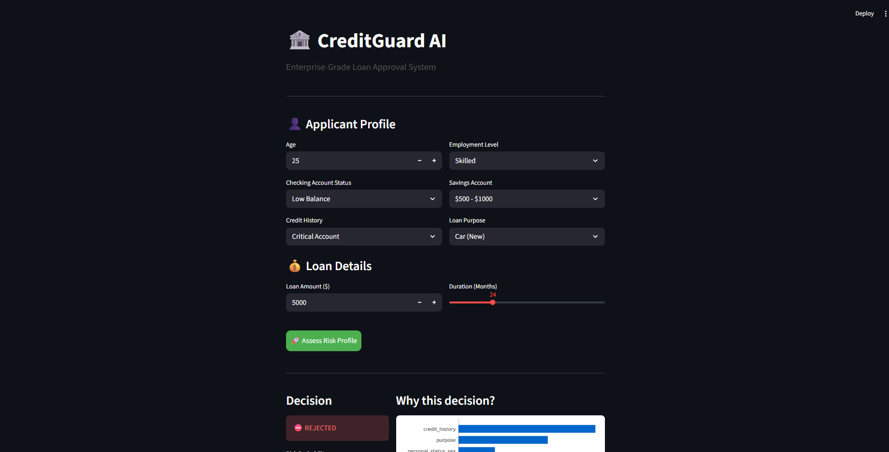

# 🏦 CreditGuard AI: Credit Risk Assessment Engine

**A Machine Learning-powered system that predicts loan default probability and provides explainable risk insights for financial institutions.**


## 🚀 Overview
In the financial sector, accurately assessing credit risk is critical. Traditional rule-based systems often fail to capture complex patterns, while "Black Box" AI models lack transparency.

**CreditGuard AI** solves this by:
1.  **Predicting Default Risk:** Using an XGBoost classifier trained on historical financial data.
2.  **Handling Data Imbalance:** Utilizing **SMOTE (Synthetic Minority Over-sampling Technique)** to ensure the model learns to identify risky borrowers effectively, not just safe ones.
3.  **Explainable AI (XAI):** Integrating **SHAP (SHapley Additive exPlanations)** to tell the loan officer *exactly why* a loan was rejected (e.g., "Age is too low" or "Debt is too high").

## 🛠️ Tech Stack
* **Core:** Python 3.10+
* **Machine Learning:** XGBoost, Scikit-Learn (SMOTE)
* **Explainability:** SHAP
* **Data Processing:** Pandas, NumPy, SQLite
* **Dashboard:** Streamlit

## 📊 Key Features
* **End-to-End Pipeline:** From raw CSV -> SQLite Data Warehouse -> ML Training -> Inference.
* **Imbalanced Data Handling:** Achieved **0.84 F1-Score** on the minority class (Defaulters) using SMOTE.
* **Real-Time Inference:** Instant decision-making via the web dashboard.
* **Decision Transparency:** Dynamic SHAP waterfall charts for every prediction.

## 📸 Demo

### 1. Risk Analysis (Approved)

*The model approves a low-risk applicant, citing high checking balance and paid existing credits as positive factors.*

### 2. Risk Analysis (Rejected)

*The model rejects a high-risk applicant. The SHAP chart highlights "No Checking Account" and "young age" as the primary drivers for rejection.*

## ⚡ How to Run Locally

1.  **Clone the Repository**
    ```bash
    git clone [https://github.com/Pranit-satnurkar/credit-risk-scoring.git](https://github.com/Pranit-satnurkar/credit-risk-scoring.git)
    cd credit-risk-scoring
    ```

2.  **Install Dependencies**
    ```bash
    pip install -r requirements.txt
    ```

3.  **Initialize the Database**
    Parses the raw CSV and loads it into SQLite.
    ```bash
    python ingest_data.py
    ```

4.  **Train the Model**
    Trains XGBoost, applies SMOTE, and saves the model artifact.
    ```bash
    python train_model.py
    ```

5.  **Run the Dashboard**
    ```bash
    streamlit run app.py
    ```

## 📂 Project Structure
```text
├── app.py               # Streamlit Dashboard (Frontend)
├── train_model.py       # ML Pipeline (Training & Evaluation)
├── ingest_data.py       # ETL Script (CSV to SQL)
├── bank_data.db         # SQLite Data Warehouse (Created by ingest script)
├── credit_model.xgb     # Trained Model Artifact
├── requirements.txt     # Python Dependencies
└── README.md            # Documentation
